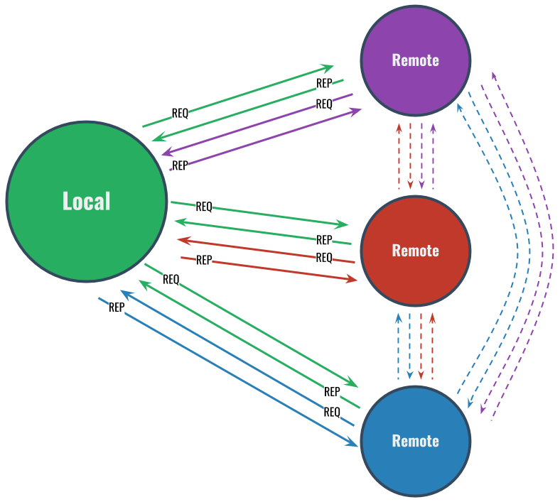

# LiveNet

**Demo of gRPC streaming for liveness detection in a fully connected network.**

Proof of concept for a fully connected network that uses gRPC streams for constant messaging without exchanging meta information between RPC requests. By detecting if the stream is closed, each host on the network can determine if the connection is live or not. Hosts can reconnect at anytime to repair the state of the network.

This system also demonstrates the use of a message multiplexer so that a single stream between hosts is used. This model hijacks the gRPC server handler definitions, but the hosts implement an actor model so each message is treated as an independent event.



As you can see, the LiveNet architecture implements two streams between each peer on the network. The first stream, implemented via the `Remote` struct allows the localhost to send requests to the remote peer and and get replies back. The second stream is connected when the remote peer connects to the stream server and sends requests, to which replies are sent back. All four streams are completely independent.

## Questions

1. How long can a stream be kept open and messages passed?
2. Does the stream on the remote need to be guarded by a mutex?
3. Can we implement a client service using streaming as well?

## Running LiveNet

Install the LiveNet command as follows:

```
$ go get github.com/bbengfort/livenet/...
```

Create a configuration file per host, `config.json`, as follows:

```json
{
  "tick": "500ms",
  "log_level": 2,
  "peers": [
    {
      "pid": 1,
      "name": "alpha",
      "ip_address": "localhost",
      "port": 3264
    },
    {
      "pid": 2,
      "name": "bravo",
      "ip_address": "localhost",
      "port": 3265
    },
    {
      "pid": 3,
      "name": "charlie",
      "ip_address": "localhost",
      "port": 3266
    }
  ]
}
```

Then run each server with the `livenet serve` command, specify `-c` to supply the path to the configuration file (looks for `config.json` by default). You can also specify the name of the localhost with the `-n` flag, by default the name is the hostname of the machine.

The LiveNet server will send heartbeat messages every 500ms - 1 second to all of its peers, and every 8 minutes or so will print a status message about the connections.
